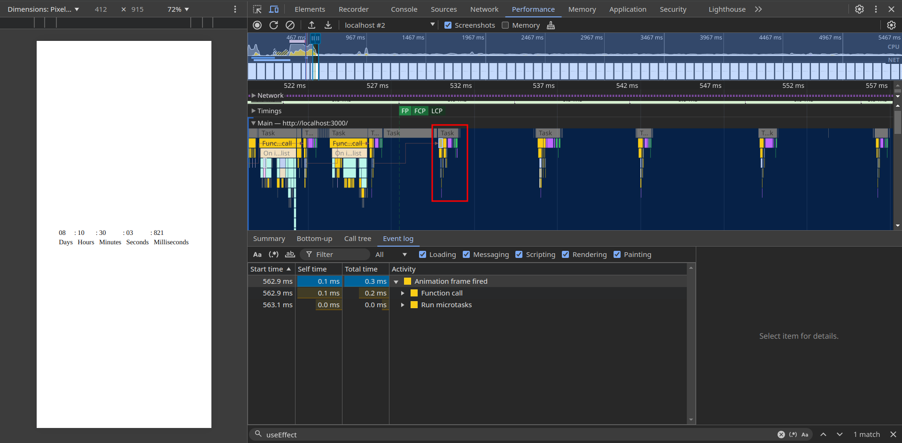

Test advanced react concepts:

# Installation

- clone the repo
- `npm instal`
- `npm run dev`
- open `http://localhost:3000`
- open dev tools / console
  - configure verbosity level: info only
  - disable setting: 'Group similar messages in console'
  - refresh the page
    - wait for `rc` (render count) values

# Components:
 
## `CheapTimer` component

  - Useful for counting down the time to a future date
  - Direct access to the DOM
    - no state change during animation frames
    - effectively skips having a virtual DOM/diffing for the digits elements
    - no re-renders caused
    - inner text is altered
  - use of `ref` to:
    - know total renderings
    - hold a reference of elements to update
    - preserve initial values of the time remaining to the specified date
  - avoids SSR / CSR DOM mismatch
    - waits for the first component mount
    - change the state to `isClient = true`
    - re-renders the component one time
    - starts client side DOM updates via animation frame request
      - runs at 60 fps
      - tasks take about 0.1 ms self time to complete
  - template prevents mounting
    - the caller checks the data and do not mount the component in the tree
  - component stops
    - once the halt condition is detected (when remaining time is close to 0), it cancels the next animation frame request
    - does it half a second before to be able to schedule the cancellation
  - utils included:
    - `getTimeByUnit`: takes a unix timestamp in milliseconds and transform it to its `{ years, days, hours, minutes, seconds, milliseconds }` representation.
    - `getFutureISODate`: takes `{ years, days, hours, minutes, seconds, milliseconds }` and returns a iso 8601 formatted date. 
